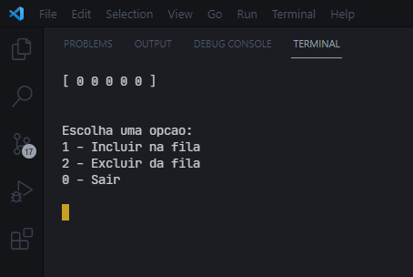
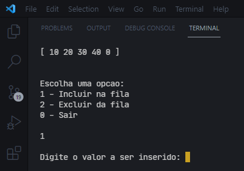

# Estrutura-de-dados-C
Exercícios para treinar estrutura de dados em linguagem C
<h2>Exercícios sobre lista estática</h2>

Exercícios para fixar conteudo aprendido no curso de Ánalise e desenvolvimento de sistemas da Unicesumar

 

Foi criada uma lista estatica com vetor definido de 5 espaços

<h2>Exercício para lista dinâmica</h2>
